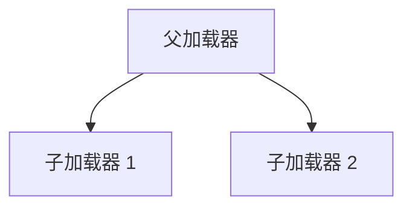

# 从原理到实践，深入浅出 JVM 类加载性能调优

在 Java 应用中，**类加载的性能问题** 是影响系统启动速度、内存使用和模块稳定性的重要因素。我将以简单明了的语言和丰富的案例介绍如何优化类加载的性能。

这不仅能提升程序的响应速度，还能让系统更加稳定健壮。

## 减少不必要的类加载

启动时间调优是指通过减少类的加载数量或优化类加载过程，缩短程序从启动到正常运行的时间。

对于需要快速响应的应用（如微服务），启动时间优化尤为重要。这种优化不仅能提升用户体验，还能减少系统初始化时的资源浪费。

当应用程序启动时，JVM 可能会加载大量的类，其中许多类在启动阶段并不需要使用，但仍然被加载，导致以下问题：

- **启动时间过长**：大型项目中，每次启动可能需要数十秒甚至更长时间。
- **资源浪费**：加载未使用的类占用了额外的内存。
- **调试困难**：大量类加载日志增加了调试复杂度。

### **延迟加载（Lazy Loading）**

> 唐二婷：码哥靓仔，如何解决这个问题？

**核心思想**：将类的加载推迟到真正需要使用时进行，避免在启动阶段加载所有可能用到的类。

**案例：Spring 的延迟加载**

在 Spring 框架中，可以通过以下配置启用延迟加载：

```xml
<beans default-lazy-init="true">
    <!-- Bean definitions -->
</beans>
```

这样，只有在首次访问某个 Bean 时，相关类才会被加载和初始化。通过这种方式，可以显著减少启动时的资源消耗。

**深入分析：延迟加载的原理**

- Spring 使用动态代理技术，在调用对象时触发实际类的加载。
- 结合 IoC 容器的管理，确保按需加载不会打乱依赖关系。

### 精简类路径

> 唐二婷：过多的第三方库会导致类加载器需要花费更多时间搜索类路径，要怎么解决呢？

**解决方案**：

- **清理无用的 JAR 包**：减少类路径中的冗余依赖。
- **使用工具分析依赖**：如 `jdeps` 工具，可以帮助检查哪些库是不必要的。
- **模块化类路径管理**：在大型项目中，使用 Maven 或 Gradle 对依赖进行分层管理。

### 预加载（Preloading

**核心思想**：对于高频使用的类，可以显式地在应用启动时加载。

**示例代码**：

```java
Class.forName("com.example.HighFrequencyClass");
```

**优点**：

- 缓解运行时类加载的延迟。
- 避免首次使用时的性能抖动。

**注意事项**：

- 仅对核心类或关键模块使用预加载，避免无意义的资源浪费。
- 使用性能监控工具（如 VisualVM）确认哪些类是高频调用的。

通过以上优化策略，以下问题得到了有效解决：

1. **启动时间缩短**：微服务应用的启动时间从 20 秒缩减至 10 秒以内。
2. **内存使用效率提高**：优化后，启动时的内存占用降低了 30%。
3. **调试更加清晰**：减少了无用的类加载日志，调试效率显著提升。

优化后的系统能够更快速地响应用户请求，同时减少了启动阶段的资源开销。

## 类加载冲突与死锁优化

在 Java 应用中，**类加载冲突** 和 **死锁问题** 是影响系统稳定性和模块协作的关键因素。

通过分析这些问题的根源并采取有效的优化策略，可以显著提升系统的健壮性和开发效率。

> 唐二婷：什么是类加载冲突和死锁？

### 类加载冲突

当多个类加载器加载了同一个类但来自不同的上下文时，可能导致 `ClassCastException` 或 `NoClassDefFoundError`。这是由于 JVM 无法确定哪个类定义应被使用。

在模块化系统中，模块 A 和模块 B 分别加载了 `common.utils.StringUtil`，但它们的类加载器不一致，导致无法共享。

### 类加载死锁

两个线程试图加载彼此依赖的类时，可能陷入循环等待，导致程序无响应。

线程 1 试图加载类 A，同时线程 2 试图加载类 B，而 A 和 B 互相依赖。

> 唐二婷：为什么会发生这些问题？

### **类加载冲突的根源**

- **模块化设计不完善**：公共类未统一由父加载器加载。
- **破坏双亲委派模型**：开发者自定义类加载器时未严格遵循父子委派原则。

### **死锁的根源**

- **类加载器依赖链不清晰**：加载链中存在循环依赖。
- **线程并发问题**：多个线程同时触发类加载，未正确处理同步。

> 如何解决这些问题？

### 遵循双亲委派模型


**核心思想**：

- 确保公共类由父加载器加载，避免重复加载。

**示例**：



**实践**：

- 将公共类库（如日志框架）放置在父加载器可见的路径中。
- 在自定义类加载器中，优先调用 `super.loadClass()`，确保公共类先由父加载器加载。

### 优化类加载器的依赖关系

**核心思想**：

- 避免类加载器之间的循环依赖。

**实践**：

- 使用依赖分析工具（如 `jstack`）检查加载链。
- 对于强依赖关系，调整类加载顺序，确保依赖链单向无环。

**案例**：
在一个插件化系统中，开发团队通过分析依赖链，发现插件 A 和插件 B 存在循环依赖，最终将公共依赖提取到父加载器中。

### 模块隔离与类加载器设计

**核心思想**：

- 为每个模块分配独立的类加载器，确保隔离性。

**实践**：

- 在插件化框架中，如 OSGi 或 Spring Boot，每个模块使用独立的 `ClassLoader`。
- 为模块定义明确的类加载边界，减少模块间的耦合。

**示例代码**：

```java
public class ModuleClassLoader extends ClassLoader {
    private String modulePath;

    public ModuleClassLoader(String modulePath) {
        this.modulePath = modulePath;
    }

    @Override
    protected Class<?> findClass(String name) throws ClassNotFoundException {
        String fileName = modulePath + name.replace('.', '/') + ".class";
        try (InputStream is = new FileInputStream(fileName)) {
            byte[] classData = is.readAllBytes();
            return defineClass(name, classData, 0, classData.length);
        } catch (IOException e) {
            throw new ClassNotFoundException(name, e);
        }
    }
}
```

通过上述优化，以下问题得到了有效解决：

1. **类加载冲突减少**：公共类统一由父加载器加载，避免了多次加载带来的冲突。
2. **系统稳定性提升**：优化了类加载顺序和模块设计，减少了死锁的可能性。
3. **模块化开发更高效**：类加载器的隔离设计让插件或模块可以独立演进。

## 元空间优化与内存管理

在 Java 8 之后，JVM 引入了元空间（Metaspace），取代了之前的永久代（PermGen），用来存储类的元数据。

尽管元空间的动态扩展能力提升了内存管理的灵活性，但其不当使用仍可能导致内存膨胀或性能问题。

接下来将深入探讨元空间的优化策略，让你更高效地管理 JVM 的内存资源。

> 什么是元空间？

### 定义

元空间（Metaspace）是 JVM 用于存储类元数据的内存区域，主要包括类的名称、方法、字段信息等。元空间位于本地内存中，与 Java 堆分离。

在 JDK 6 版本中，方法区的实现是 `永久代`，用于存储 `类信息`、`方法信息`、`域信息`、`JIT代码缓存`、`运行时常量池`、`字符串常量池`、`类变量` 等信息。


在 JDK 7 版本中，方法区的实现也是 `永久代`，不过对其中的 `字符串常量池` 和 `类变量` 的位置进行了调整，将其转移到了 `堆空间` 中进行存储。

这一改动主要是为了缓解永久代 `OutOfMemoryError` 的问题，因为字符串常量池和类变量在某些应用中可能占用大量内存，而频繁的类加载和卸载也会导致永久代空间紧张。


在 JDK 8 版本中，JVM 移除了 `永久代`，使用 `元空间` 作为 `方法区` 的实现，元空间使用的是本地内存，其大小受制于本地内存大小的限制，可以一定程度上避免发生 `OutOfMemoryError` 错误。


### 为什么引入元空间？

在 JDK 7 及之前，类元数据存储在永久代（PermGen）中。但永久代存在以下问题：

- **大小固定**：永久代的大小在 JVM 启动时确定，扩展性差。
- **垃圾回收复杂**：永久代的 GC 频率低，可能导致类元数据无法及时释放。
- **配置困难**：开发者需手动调整永久代大小，增加了配置的复杂性。

引入元空间后，类元数据存储于本地内存，内存上限可动态调整，提高了内存管理的灵活性。

> 唐二婷：没有最好，只有更好，元空间就万无一失了吗？

尽管元空间解决了永久代的诸多问题，但仍可能因以下原因出现内存相关问题：

- **元空间膨胀**：加载大量类时，元空间消耗显著增加，可能导致 `OutOfMemoryError: Metaspace`。
- **内存泄漏**：动态生成类或频繁加载类时，未及时释放的类元数据会持续占用元空间。
- **性能下降**：元空间扩展过程需要申请额外的本地内存，可能导致性能抖动。

> 唐二婷：如何解决这些问题？

### 限制元空间大小

通过设置 JVM 参数限制元空间的大小，可以避免内存膨胀问题。

**常用参数**：

- `-XX:MaxMetaspaceSize=<size>`：设置元空间的最大值。
- `-XX:MetaspaceSize=<size>`：设置元空间的初始大小。
- `-XX:MinMetaspaceFreeRatio` 和 `-XX:MaxMetaspaceFreeRatio`：控制元空间扩展的阈值。

**示例**：

```bash
java -XX:MaxMetaspaceSize=256m -XX:MetaspaceSize=128m MyApp
```

**结果**：

- 避免元空间无限扩展导致的 `OutOfMemoryError`。
- 提升内存使用的可预测性。

### 减少类的重复加载

**问题**：在模块化应用中，不同模块的类加载器可能加载了相同的类，导致元空间重复占用。

**优化策略**：

- **合并公共类**：将常用的公共类统一加载到父加载器中，减少类的重复加载。
- **共享类库设计**：通过明确模块边界，避免跨模块加载重复类。

**案例**：
在微服务架构中，开发团队通过合并公共依赖类，将元空间使用减少了 20%。

### 监控元空间使用情况

定期监控元空间的使用情况，可以帮助开发者及时发现潜在问题。

**工具**：

- **JVisualVM**：实时监控元空间的使用。
- **jstat**：通过命令行查看元空间的大小。

**示例命令**：

```bash
jstat -gcutil <pid>
```

输出中 `M` 列显示元空间的使用百分比。
通过持续监控，开发者可以动态调整元空间参数，并及时清理不必要的类。

通过对元空间的合理配置和监控，以下问题得到了有效解决：

1. **内存膨胀问题缓解**：通过限制元空间大小和优化类加载逻辑，减少了内存溢出的风险。
2. **系统性能提升**：优化后的元空间使用效率更高，减少了动态扩展带来的性能抖动。
3. **内存利用率更高**：通过减少重复类加载，优化了整体内存结构。