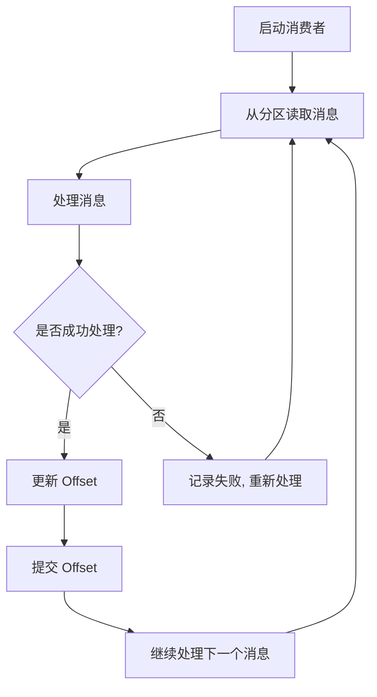

你好，我是《Redis 高手心法》作者，可以叫我码哥，手拿菜刀砍电线，一路火花带闪电的靓仔。

那 Kafka 的架构是怎样的？又是怎么做到其吞吐量动辄几十上百万的呢？

1. Kafka I/O 模型拆解；
2. 零拷贝技术的运用；
3. Kakfa 架构设计和负载均衡；
   1. Kafka 架构
   2. Topic 实现原理
   3. partition 水平拓展和负载均衡算法

4. 分段（Segment）存储消息实现原理
5. 磁盘顺序写、pageCache
6. 数据压缩。


## Kafka Reactor I/O 网络模型

[Kafka Reactor I/O 网络模型](https://mp.weixin.qq.com/s?__biz=MzkzMDI1NjcyOQ==&mid=2247503469&idx=1&sn=fc6dea24311b1b5b6d2bf0f6b58673f3&chksm=c27f8c5bf508054df0fad0f0cc3a4cc6d169e35e13a6e04dd624bdd33d7aba2fea9645c718b5&scene=178&cur_album_id=3485080895185338375#rd)是一种非阻塞 I/O 模型，利用事件驱动机制来处理网络请求。更多细节详见[《Kafka 高性能 7 大秘诀之 Reactor 网络 I/O 模型》](https://mp.weixin.qq.com/s?__biz=MzkzMDI1NjcyOQ==&mid=2247503469&idx=1&sn=fc6dea24311b1b5b6d2bf0f6b58673f3&chksm=c27f8c5bf508054df0fad0f0cc3a4cc6d169e35e13a6e04dd624bdd33d7aba2fea9645c718b5&scene=178&cur_album_id=3485080895185338375#rd)

该模型通过 Reactor 模式实现，即一个或多个 I/O 多路复用器（如 Java 的 Selector）监听多个通道的事件，当某个通道准备好进行 I/O 操作时，触发相应的事件处理器进行处理。

这种模型在高并发场景下具有很高的效率，能够同时处理大量的网络连接请求，而不需要为每个连接创建一个线程，从而节省系统资源。

Reactor 线程模型如图 2 所示。


图 2

Reacotr 模型主要分为三个角色。

- Reactor：把 I/O 事件根据类型分配给分配给对应的 Handler 处理。
- Acceptor：处理客户端连接事件。
- Handler：处理读写等任务。

Kafka 基于 Reactor 模型架构如图 3 所示。


图 3

Kafka 的网络通信模型基于 NIO（New Input/Output）库，通过 Reactor 模式实现，具体包括以下几个关键组件：

- **SocketServer**：管理所有的网络连接，包括初始化 Acceptor 和 Processor 线程。
- **Acceptor**：监听客户端的连接请求，并将其分配给 Processor 线程。Acceptor 使用 Java NIO 的 `Selector` 进行 I/O 多路复用，并注册 OP_ACCEPT 事件来监听新的连接请求。每当有新的连接到达时，Acceptor 会接受连接并创建一个 `SocketChannel`，然后将其分配给一个 Processor 线程进行处理。
- **Processor**：处理具体的 I/O 操作，包括读取客户端请求和写入响应数据。Processor 同样使用 `Selector` 进行 I/O 多路复用，注册 OP_READ 和 OP_WRITE 事件来处理读写操作。每个 Processor 线程都有一个独立的 `Selector`，用于管理多个 `SocketChannel`。
- **RequestChannel**：充当 Processor 和请求处理线程之间的缓冲区，存储请求和响应数据。Processor 将读取的请求放入 RequestChannel 的请求队列，而请求处理线程则从该队列中取出请求进行处理。
- **KafkaRequestHandler**：请求处理线程，从 RequestChannel 中读取请求，调用 KafkaApis 进行业务逻辑处理，并将响应放回 RequestChannel 的响应队列。KafkaRequestHandler 线程池中的线程数量由配置参数 `num.io.threads` 决定。


图 4

> Chaya：该模型和如何提高 kafka 的性能和效率？

**高并发处理能力**：通过 I/O 多路复用机制，Kafka 能够同时处理大量的网络连接请求，而不需要为每个连接创建一个线程，从而节省了系统资源。

**低延迟**：非阻塞 I/O 操作避免了线程的阻塞等待，使得 I/O 操作能够更快地完成，从而降低了系统的响应延迟。

**资源节省**：通过减少线程的数量和上下文切换，Kafka 在处理高并发请求时能够更有效地利用 CPU 和内存资源。

**扩展性强**：Reactor 模式的分层设计使得 Kafka 的网络模块具有很好的扩展性，可以根据需要增加更多的 I/O 线程或调整事件处理器的逻辑。

## 零拷贝技术的运用

零拷贝技术是一种计算机操作系统技术，用于在内存和存储设备之间进行数据传输时，避免 CPU 的参与，从而减少 CPU 的负担并提高数据传输效率。详见《[Kakfa 高性能架构设计之零拷贝技术的运用](https://mp.weixin.qq.com/s?__biz=MzkzMDI1NjcyOQ==&mid=2247503458&idx=1&sn=c5cf7a30b96abadaf4497a73f27ec219&chksm=c27f8c54f50805420129980d78b5671fc5d0b7fdcfab259d5249598d88aa0bb2224419311e64&scene=178&cur_album_id=3485080895185338375#rd)》

Kafka 使用零拷贝技术来优化数据传输，特别是在生产者将数据写入 Kafka 和消费者从 Kafka 读取数据的过程中。在 Kafka 中，零拷贝主要通过以下几种方式实现：

- **sendfile() 系统调用**：在发送数据时，Kafka 使用操作系统的 sendfile() 系统调用直接将文件从磁盘发送到网络套接字，而无需将数据复制到应用程序的用户空间。这减少了数据复制次数，提高了传输效率。
- **文件内存映射（Memory-Mapped Files）**：Kafka 使用文件内存映射技术（mmap），将磁盘上的日志文件映射到内存中，使得读写操作可以在内存中直接进行，无需进行额外的数据复制。

比如 Broker 读取磁盘数据并把数据发送给 Consumer 的过程，传统 I/O 经历以下步骤。

1. **读取数据**：通过`read` 系统调用将磁盘数据通过 DMA copy 到内核空间缓冲区（Read buffer）。

2. **拷贝数据**：将数据从内核空间缓冲区（Read buffer） 通过 CPU copy 到用户空间缓冲区（Application buffer）。

3. **写入数据**：通过`write()`系统调用将数据从用户空间缓冲区（Application） CPU copy 到内核空间的网络缓冲区（Socket buffer）。

4. **发送数据**：将内核空间的网络缓冲区（Socket buffer）DMA copy 到网卡目标端口，通过网卡将数据发送到目标主机。

这一过程经过的四次 copy 如图 5 所示。


图 5

> Chaya：零拷贝技术如何提高 Kakfa 的性能？

零拷贝技术通过减少 CPU 负担和内存带宽消耗，提高了 Kakfa 性能。

- **降低 CPU 使用率**：由于数据不需要在内核空间和用户空间之间多次复制，CPU 的参与减少，从而降低了 CPU 使用率，腾出更多的 CPU 资源用于其他任务。

- **提高数据传输速度**：直接从磁盘到网络的传输路径减少了中间步骤，使得数据传输更加高效，延迟更低。

- **减少内存带宽消耗**：通过减少数据在内存中的复制次数，降低了内存带宽的消耗，使得系统能够处理更多的并发请求。

## Partition 并发和分区负载均衡

在说 Topic patition 分区并发之前，我们先了解下 kafka 架构设计。

### Kafka 架构

一个典型的 Kafka 架构包含以下几个重要组件，如图 6 所示。


图 6

1. **Producer（生产者）**：发送消息的一方，负责发布消息到 Kafka 主题（Topic）。

2. **Consumer（消费者）**：接受消息的一方，订阅主题并处理消息。Kafka 有 ConsumerGroup 的概念，每个 Consumer 只能消费所分配到的 Partition 的消息，每一个 Partition 只能被一个 ConsumerGroup 中的一个 Consumer 所消费，所以同一个 ConsumerGroup 中 Consumer 的数量如果超过了 Partiton 的数量，将会出现有些 Consumer 分配不到 partition 消费。

3. **Broker（代理）**：服务代理节点，Kafka 集群中的一台服务器就是一个 broker，可以水平无限扩展，**同一个 Topic 的消息可以分布在多个 broker 中**。

4. **Topic（主题）与 Partition（分区）** ：Kafka 中的消息以 Topic 为单位进行划分，生产者将消息发送到特定的 Topic，而消费者负责订阅 Topic 的消息并进行消费。图中 TopicA 有三个 Partiton（TopicA-par0、TopicA-par1、TopicA-par2）

   为了提升整个集群的吞吐量，Topic 在物理上还可以细分多个 Partition，一个 Partition 在磁盘上对应一个文件夹。

5. **Replica（副本）**：副本，是 Kafka 保证数据高可用的方式，Kafka **同一 Partition 的数据可以在多 Broker 上存在多个副本**，通常只有 leader 副本对外提供读写服务，当 leader 副本所在 broker 崩溃或发生网络一场，Kafka 会在 Controller 的管理下会重新选择新的 Leader 副本对外提供读写服务。

6. **ZooKeeper**：管理 Kafka 集群的元数据和分布式协调。

### Topic 主题

Topic 是 Kafka 中数据的逻辑分类单元，可以理解成一个队列。Broker 是所有队列部署的机器，Producer 将消息发送到特定的 Topic，而 Consumer 则从特定的 Topic 中消费消息。


### Partition

为了提高并行处理能力和扩展性，Kafka 将一个 Topic 分为多个 Partition。每个 Partition 是一个有序的消息队列，消息在 Partition 内部是有序的，但在不同的 Partition 之间没有顺序保证。

Producer 可以并行地将消息发送到不同的 Partition，Consumer 也可以并行地消费不同的 Partition，从而提升整体处理能力。


因此，可以说，**每增加一个 Paritition 就增加了一个消费并发。Partition 的引入不仅提高了系统的可扩展性，还使得数据处理更加灵活。**

### Partition 分区策略

> 码楼：“生产者将消息发送到哪个分区是如何实现的？不合理的分配会导致消息集中在某些 Broker 上，岂不是完犊子。”

主要有以下几种分区策略：

1. **轮询策略**：也称 Round-robin 策略，即顺序分配。
2. **随机策略**：也称 Randomness 策略。所谓随机就是我们随意地将消息放置到任意一个分区上。
3. **按消息键保序策略**。
4. 基于地理位置分区策略。

#### 轮询策略

比如一个 Topic 下有 3 个分区，那么第一条消息被发送到分区 0，第二条被发送到分区 1，第三条被发送到分区 2，以此类推。

当生产第 4 条消息时又会重新开始，即将其分配到分区 0，如图 5 所示。


**轮询策略有非常优秀的负载均衡表现，它总是能保证消息最大限度地被平均分配到所有分区上，故默认情况下它是最合理的分区策略，也是我们最常用的分区策略之一。**

#### 随机策略

所谓随机就是我们随意地将消息放置到任意一个分区上。如图所示，9 条消息随机分配到不同分区。


#### 按消息键分配策略

一旦消息被定义了 Key，那么你就可以保证同一个 Key 的所有消息都进入到相同的分区里面，比如订单 ID，那么绑定同一个 订单 ID 的消息都会发布到同一个分区，由于每个分区下的消息处理都是有顺序的，故这个策略被称为按消息键保序策略，如图所示。


#### 基于地理位置

这种策略一般只针对那些大规模的 Kafka 集群，特别是跨城市、跨国家甚至是跨大洲的集群。

我们就可以根据 Broker 所在的 IP 地址实现定制化的分区策略。比如下面这段代码：

```java
List<PartitionInfo> partitions = cluster.partitionsForTopic(topic);
return partitions.stream()
  .filter(p -> isSouth(p.leader().host()))
  .map(PartitionInfo::partition)
  .findAny()
  .get();
```

我们可以从所有分区中找出那些 Leader 副本在南方的所有分区，然后随机挑选一个进行消息发送。

## Segment 日志文件和稀疏索引

前面已经介绍过，**Kafka 的 Topic 可以分为多个 Partition，每个 Partition 有多个副本，你可以理解为副本才是存储消息的物理存在。其实每个副本都是以日志（Log）的形式存储。**

> 码楼：“日志文件过大怎么办？”

**为了解决单一日志文件过大的问题，kafka 采用了分段（Segment）的形式进行存储**。

所谓 Segment，就是当一个日志文件大小到达一定条件之后，就新建一个新的 Segment，然后在新的 Segment 写入数据。Topic、Partition、和日志的关系如图 8 所示。


图 8

一个 **segment** 对应磁盘上多个文件。

- `.index` : 消息的 **offset** 索引文件。

- `.timeindex` : 消息的时间索引文件(0.8 版本加入的)。

- `.log` : 存储实际的消息数据。

- `.snapshot` : 记录了 producer 的事务信息。

- `.swap` : 用于 **Segment** 恢复。

- `.txnindex` 文件，记录了中断的事务信息。

`.log` 文件存储实际的 message，kafka 为每一个日志文件添加了 2 个索引文件 `.index`以及 `.timeindex`。

segment 文件命名规则：**partition 第一个 segment 从 0 开始，后续每个 segment 文件名为上一个 segment 文件最后一条消息的 offset 值。数值最大为 64 位 lo**ng 大小，19 位数字字符长度，没有数字用 0 填充。

> 码楼：“为什么要有 `.index` 文件？”

为了提高查找消息的性能。**kafka** 为消息数据建了两种**稀疏索引**，一种是方便 **offset** 查找的 **.index 稀疏索引**,还有一种是方便时间查找的 **.timeindex 稀疏索引**。

### 稀疏索引

> Chaya：“为什么不创建一个哈希索引，从 offset 到物理消息日志文件偏移量的映射关系？”

万万不可，Kafka 作为海量数据处理的中间件，每秒高达几百万的消息写入，这个哈希索引会把把内存撑爆炸。

稀疏索引不会为每个记录都保存索引，而是写入一定的记录之后才会增加一个索引值，具体这个间隔有多大则通过 `log.index.interval.bytes` 参数进行控制，默认大小为 4 KB，意味着 Kafka 至少写入 4KB 消息数据之后，才会在索引文件中增加一个索引项。

哈希稀疏索引把消息划分为多个 block ，只索引每个 block 第一条消息的 offset 即可 。


- Offset 偏移量：表示第几个消息。
- position：消息在磁盘的物理位置。

> Chaya：如果消费者要查找 Offset 为 4 的消息，查找过程是怎样的？

- 首先用二分法定位消息在哪个 Segment ，Segment 文件命名是 Partition 第一个 segment 从 0 开始，后续每个 segment 文件名为上一个 segment 文件最后一条消息的 offset 值。
- 打开这个 Segment 对应的 index 索引文件，用二分法查找 offset 不大于 4 的索引条目，对应上图第二条条目，也就是 offset = 3 的那个索引。通过索引我们可以知道 offset 为 4 的消息所在的日志文件磁盘物理位置为 495。

- 打开日志文件，从 Position 为 495 位置开始开始顺序扫描文件，将扫描过程中每条消息的 offset 与 4 比较，直到找到 offset 为 4 的那条 Message。


**.timeindex** 文件同理，只不过它的查找结果是 **offset**，之后还要在走一遍 **.index** 索引查找流程。

由于 **kafka** 设计为顺序读写磁盘，因此遍历区间的数据并对速度有太大的影响，而选择**稀疏索引**还能节约大量的磁盘空间。

### mmap

有了稀疏索引，当给定一个 offset 时，Kafka 采用的是二分查找来扫描索引定位不大于 offset 的物理位移 position，再到日志文件找到目标消息。

利用稀疏索引，已经基本解决了高效查询的问题，但是这个过程中仍然有进一步的优化空间，那便是**通过 mmap(memory mapped files) 读写上面提到的稀疏索引文件，进一步提高查询消息的速度**。

就是基于 JDK nio 包下的 MappedByteBuffer 的 map 函数，将磁盘文件映射到内存中。

进程通过调用 mmap 系统函数，将文件或物理内存的一部分映射到其虚拟地址空间。这个过程中，操作系统会为映射的内存区域分配一个虚拟地址，并将这个地址与文件或物理内存的实际内容关联起来。

一旦内存映射完成，进程就可以通过指针直接访问映射的内存区域。这种访问方式就像访问普通内存一样简单和高效。


图引自《码农的荒岛求生》

## 顺序读写磁盘

> 码楼：“不管如何，Kafka 读写消息都要读写磁盘，如何变快呢？”

磁盘就一定很慢么？人们普遍错误地认为硬盘很慢。然而，存储介质的性能，很大程度上依赖于数据被访问的模式。

同样在一块普通的 7200 RPM SATA 硬盘上，随机 I/O（random I/O）与顺序 I/O 相比，随机 I/O 的性能要比顺序 I/O 慢 3 到 4 个数量级。

合理的方式可以让磁盘写操作更加高效，减少了寻道时间和旋转延迟。

码楼，你还留着课本吗？来，翻到讲磁盘的章节，让我们回顾一下磁盘的运行原理。

> 码楼：“鬼还留着哦，课程还没上到一半书就没了。要不是考试俺眼神好，就挂科了。”

磁盘的运行原理如图所示。


硬盘在逻辑上被划分为磁道、柱面以及扇区。硬盘的每个盘片的每个面都有一个读写磁头。

完成一次磁盘 I/O ，需要经过`寻道`、`旋转`和`数据传输`三个步骤。

1. **寻道**：首先必须找到柱面，即磁头需要移动到相应磁道，这个过程叫做寻道，所耗费时间叫做寻道时间。寻道时间越短，I/O 操作越快，目前磁盘的平均寻道时间一般在 3-15ms。
2. **旋转**：磁盘旋转将**目标扇区旋转到磁头下**。这个过程耗费的时间叫做旋转时间。旋转延迟取决于磁盘转速，通常用磁盘旋转一周所需时间的 1/2 表示。比如：7200rpm 的磁盘平均旋转延迟大约为 60\*1000/7200/2 = 4.17ms，而转速为 15000rpm 的磁盘其平均旋转延迟为 2ms。
3. **数据传输**：数据在磁盘与内存之间的实际传输。

因此，如果在写磁盘的时候省去`寻道`、`旋转`可以极大地提高磁盘读写的性能。

Kafka 采用`顺序写`文件的方式来提高磁盘写入性能。`顺序写`文件，顺序 I/O 的时候，磁头几乎不用换道，或者换道的时间很短。减少了磁盘`寻道`和`旋转`的次数。磁头再也不用在磁道上乱舞了，而是一路向前飞速前行。

**Kafka 中每个 Partition 是一个有序的，不可变的消息序列，新的消息可以不断追加到 Partition 的末尾，在 Kafka 中 Partition 只是一个逻辑概念，每个 Partition 划分为多个 Segment，每个 Segment 对应一个物理文件，Kafka 对 Segment 文件追加写，这就是顺序写文件。**

每条消息在发送前会根据负载均衡策略计算出要发往的目标 Partition 中，broker 收到消息之后把该条消息按照追加的方式顺序写入 Partition 的日志文件中。


如下图所示，可以看到磁盘顺序写的性能远高于磁盘随机写，甚至比内存随机写还快。


## PageCache

> Chaya：“码哥，使用稀疏索引和 mmap 内存映射技术提高读消息的性能；Topic Partition 加磁盘顺序写持久化消息的设计已经很快了，但是与内存顺序写还是慢了，还有优化空间么？”

小姑娘，你的想法很好，作为快到令人发指的 Kafka，确实想到了一个方式来提高读写写磁盘文件的性能。这就是接下来的主角 Page Cache 。

简而言之：利用操作系统的缓存技术，在读写磁盘日志文件时，操作的是内存，而不是文件，由操作系统决定什么在某个时间将 Page Cache 的数据刷写到磁盘中。


1. Producer 发送消息到 Broker 时，Broker 会使用 `pwrite()` 系统调用写入数据，此时数据都会先写入`page cache`。
2. Consumer 消费消息时，Broker 使用 `sendfile()` 系统调用函数，通零拷贝技术地将 Page Cache 中的数据传输到 Broker 的 Socket buffer，再通过网络传输到 Consumer。
3. leader 与 follower 之间的同步，与上面 consumer 消费数据的过程是同理的。

Kafka 重度依赖底层操作系统提供的 PageCache 功能。当上层有写操作时，操作系统只是将数据写入 PageCache，同时标记 Page 属性为 Dirty。

当读操作发生时，先从 PageCache 中查找，如果发生缺页才进行磁盘调度，最终返回需要的数据。


于是我们得到一个重要结论：**如果 Kafka producer 的生产速率与 consumer 的消费速率相差不大，那么就能几乎只靠对 broker page cache 的读写完成整个生产-消费过程，磁盘访问非常少。**

**实际上 PageCache 是把尽可能多的空闲内存都当做了磁盘缓存来使用。**

## 数据压缩和批量处理

数据压缩在 Kafka 中有助于减少磁盘空间的使用和网络带宽的消耗，从而提升整体性能。

**通过减少消息的大小，压缩可以显著降低生产者和消费者之间的数据传输时间。**

> Chaya：Kafka 支持的压缩算法有哪些？

在 Kafka 2.1.0 版本之前，Kafka 支持 3 种压缩算法：GZIP、Snappy 和 LZ4。从 2.1.0 开始，Kafka 正式支持 Zstandard 算法（简写为 zstd）。

> Chaya：这么多压缩算法，我如何选择？

一个压缩算法的优劣，有两个重要的指标：压缩比，文件压缩前的大小与压缩后的大小之比，比如源文件占用 1000 M 内存，经过压缩后变成了 200 M，压缩比 = 1000 /200 = 5，压缩比越高越高；另一个指标是压缩/解压缩吞吐量，比如每秒能压缩或者解压缩多少 M 数据，吞吐量越高越好。

### 生产者压缩

Kafka 的数据压缩主要在生产者端进行。具体步骤如下：

1. **生产者配置压缩方式**：在 KafkaProducer 配置中设置 `compression.type` 参数，可以选择 `gzip`、`snappy`、`lz4` 或 `zstd`。
2. **消息压缩**：生产者将消息批量收集到一个 `batch` 中，然后对整个 `batch` 进行压缩。这种批量压缩方式可以获得更高的压缩率。
3. **压缩消息存储**：压缩后的 `batch` 以压缩格式存储在 Kafka 的主题（Topic）分区中。
4. **消费者解压缩**：消费者从 Kafka 主题中获取消息时，首先对接收到的 `batch` 进行解压缩，然后处理其中的每一条消息。

### 解压缩

有压缩，那必有解压缩。通常情况下，Producer 发送压缩后的消息到 Broker ，原样保存起来。

Consumer 消费这些消息的时候，Broker 原样发给 Consumer，由 Consumer 执行解压缩还原出原本的信息。

> Chaya：Consumer 咋知道用什么压缩算法解压缩？

Kafka 会将启用了哪种压缩算法封装进消息集合中，这样当 Consumer 读取到消息集合时，它自然就知道了这些消息使用的是哪种压缩算法。

总之一句话：**Producer 端压缩、Broker 端保持、Consumer 端解压缩。**

### 批量数据处理

Kafka Producer 向 Broker 发送消息不是一条消息一条消息的发送，将多条消息打包成一个批次发送。

批量数据处理可以显著提高 Kafka 的吞吐量并减少网络开销。

Kafka Producer 的执行流程如下图所示：


发送消息依次经过以下处理器：

- Serialize：键和值都根据传递的序列化器进行序列化。优秀的序列化方式可以提高网络传输的效率。
- Partition：决定将消息写入主题的哪个分区，默认情况下遵循 murmur2 算法。自定义分区程序也可以传递给生产者，以控制应将消息写入哪个分区。
- Compression：默认情况下，在 Kafka 生产者中不启用压缩。Compression 不仅可以更快地从生产者传输到代理，还可以在复制过程中进行更快的传输。压缩有助于提高吞吐量，降低延迟并提高磁盘利用率。
- Record Accumulator：`Accumulate`顾名思义，就是一个消息累计器。其内部为每个 Partition 维护一个`Deque`双端队列，队列保存将要发送的 Batch**批次数据**，`Accumulate`将数据累计到一定数量，或者在一定过期时间内，便将数据以批次的方式发送出去。记录被累积在主题每个分区的缓冲区中。根据生产者批次大小属性将记录分组。主题中的每个分区都有一个单独的累加器 / 缓冲区。
- Group Send：记录累积器中分区的批次按将它们发送到的代理分组。 批处理中的记录基于 `batch.size` 和 `linger.ms` 属性发送到代理。 记录由生产者根据两个条件发送。 当达到定义的批次大小或达到定义的延迟时间时。
- Send Thread：发送线程，从 Accumulator 的队列取出待发送的 Batch 批次消息发送到 Broker。
- Broker 端处理：Kafka Broker 接收到 `batch` 后，将其存储在对应的主题分区中。
- **消费者端的批量消费**：消费者可以配置一次拉取多条消息的数量，通过 `fetch.min.bytes` 和 `fetch.max.wait.ms` 参数控制批量大小和等待时间。

## 无锁轻量级 offset

**Offset 是 Kafka 中的一个重要概念，用于标识消息在分区中的位置。**

每个分区中的消息都有一个唯一的 offset，消费者通过维护自己的 offset 来确保准确消费消息。**offset 的高效管理对于 Kafka 的性能至关重要。**


offset 是从 0 开始的，每当有新的消息写入分区时，offset 就会加 1。offset 是不可变的，即使消息被删除或过期，offset 也不会改变或重用。

**Consumer 需要向 Kafka 汇报自己的位移数据，这个汇报过程被称为提交位移**（Committing Offsets）。因为 Consumer 能够同时消费多个 partition 的数据，所以位移的提交实际上是在 partition 粒度上进行的，即**Consumer 需要为分配给它的每个 partition 提交各自的位移数据**。

提交位移主要是为了表征 Consumer 的消费进度，这样当 Consumer 发生故障重启之后，就能够从 Kafka 中读取之前提交的位移值，然后从相应的位移处继续消费。

在传统的消息队列系统中，offset 通常需要通过锁机制来保证一致性，但这会带来性能瓶颈。Kafka 的设计哲学是尽量减少锁的使用，以提升并发处理能力和整体性能。

### 无锁设计思想

Kafka 在 offset 设计中采用了一系列无锁的技术，使其能够在高并发的环境中保持高效。

- **顺序写入**：Kafka 使用顺序写入的方式将消息追加到日志文件的末尾，避免了文件位置的频繁变动，从而减少了锁的使用。

- **MMAP 内存映射文件**：Kafka 使用内存映射文件（Memory Mapped File）来访问日志数据和索引文件。这种方式使得文件数据可以直接映射到进程的虚拟地址空间中，从而减少了系统调用的开销，提高了数据访问的效率。

- **零拷贝**：Kafka 使用零拷贝（Zero Copy）技术，将数据从磁盘直接传输到网络，绕过了用户态的复制过程，大大提高了数据传输的效率。

- **批量处理**：Kafka 支持批量处理消息，在一个批次中同时处理多个消息，减少了网络和 I/O 的开销。

### 消费者 Offset 管理流程



- **启动消费者**：消费者启动并订阅 Kafka 主题的某个分区。

- **从分区读取消息**：消费者从指定分区中读取消息。

- **处理消息**：消费者处理读取到的消息。

- **是否成功处理**：判断消息是否成功处理。

  - 如果成功处理，更新 Offset。

  - 如果处理失败，记录失败原因并准备重新处理。

- **更新 Offset**：成功处理消息后，更新 Offset 以记录已处理消息的位置。

- **提交 Offset**：将更新后的 Offset 提交到 Kafka，以确保消息处理进度的持久化。

- **继续处理下一个消息**：提交 Offset 后，继续读取并处理下一个消息。

Kafka 通过无锁轻量级 offset 的设计，实现了高性能、高吞吐和低延时的目标。

## 总结

**Kafka 通过无锁轻量级 offset 的设计，实现了高性能、高吞吐和低延时的目标。**

**其 Reactor I/O 网络模型、磁盘顺序写入、内存映射文件、零拷贝、数据压缩和批量处理等技术，为 Kafka 提供了强大的数据处理能力和高效的消息队列服务。**

- **Reactor I/O 网络模型**：通过 I/O 多路复用机制，Kafka 能够同时处理大量的网络连接请求，而不需要为每个连接创建一个线程，从而节省了系统资源。
- **顺序写入**：Kafka 使用顺序写入的方式将消息追加到日志文件的末尾，避免了文件位置的频繁变动，从而减少了锁的使用。

- **MMAP 内存映射文件**：Kafka 使用内存映射文件（Memory Mapped File）来访问日志数据和索引文件。这种方式使得文件数据可以直接映射到进程的虚拟地址空间中，从而减少了系统调用的开销，提高了数据访问的效率。

- **零拷贝**：Kafka 使用零拷贝（Zero Copy）技术，将数据从磁盘直接传输到网络，绕过了用户态的复制过程，大大提高了数据传输的效率。

- **数据压缩和批量处理**：数据压缩在 Kafka 中有助于减少磁盘空间的使用和网络带宽的消耗，从而提升整体性能。；Kafka 支持批量处理消息，在一个批次中同时处理多个消息，减少了网络和 I/O 的开销。
